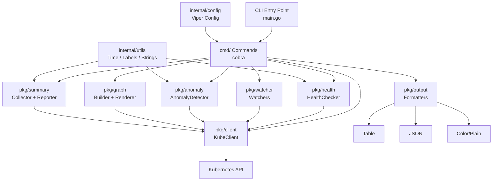

# 🔭 KubeWatch CLI

> Real-time Kubernetes cluster monitoring, anomaly detection, and dependency visualization — right from your terminal.

KubeWatch CLI connects to any Kubernetes cluster via kubeconfig, watches resources in real time, detects common failure patterns, and presents structured health reports with colorized output and multiple output formats.

[](https://go.dev)
[](https://kubernetes.io)
[](LICENSE)
[](https://github.com/spf13/cobra)
[](https://github.com/kubernetes/client-go)

---

## Screenshots

<p align="center">
  
</p>

<table>
  <tr>
    <td></td>
    <td></td>
  </tr>
  <tr>
    <td></td>
    <td></td>
  </tr>
</table>

---

## Features

- 🔍 **Real-time watching** — stream pod, deployment, service, and node events as they happen
- 🏥 **Health checks** — instant health report for all resources in a namespace with green/yellow/red status
- 🚨 **Anomaly detection** — automatically flags CrashLoopBackOff, OOMKilled, and Pending-too-long pods
- 🌳 **Dependency graph** — visualize which pods belong to which deployments and which services target them
- 📊 **Namespace summary** — at-a-glance resource counts and health overview per namespace
- 🎨 **Colorized output** — green for healthy, yellow for warning, red for critical
- 📋 **Multiple output formats** — table, JSON, or plain text
- 🔧 **Kubeconfig auto-detection** — picks up `~/.kube/config` or `KUBECONFIG` env automatically
- 🏷️ **Label selector support** — filter any command by Kubernetes label selectors
- 🌐 **All-namespaces mode** — `--all-namespaces` flag works across every command

---

## Commands

| Command | Description |
|---|---|
| `kubewatch health` | Show health status of all resources in a namespace |
| `kubewatch watch pods` | Watch pods in real time |
| `kubewatch watch deployments` | Watch deployments in real time |
| `kubewatch watch services` | Watch services in real time |
| `kubewatch watch nodes` | Watch nodes in real time |
| `kubewatch watch events` | Stream live Kubernetes events |
| `kubewatch summary` | Namespace-level resource count and health overview |
| `kubewatch anomalies` | Detect CrashLoopBackOff, OOMKilled, Pending pods |
| `kubewatch graph` | Show resource dependency relationships |
| `kubewatch version` | Print version information |

---

## Tech Stack

| Technology | Purpose |
|---|---|
| [Go 1.21+](https://go.dev) | Core language |
| [client-go](https://github.com/kubernetes/client-go) | Kubernetes API client |
| [cobra](https://github.com/spf13/cobra) | CLI framework |
| [viper](https://github.com/spf13/viper) | Configuration management |
| [controller-runtime](https://sigs.k8s.io/controller-runtime) | Watch infrastructure |
| [tablewriter](https://github.com/olekukonko/tablewriter) | Table output rendering |
| [color](https://github.com/fatih/color) | Terminal colorization |

---

## Architecture



---

## Prerequisites

- Go 1.21+
- Access to a Kubernetes cluster
- kubeconfig at `~/.kube/config` or set via `KUBECONFIG`

---

## Install & Run

### From source

```bash
git clone https://github.com/mdryaan/kubewatch-cli.git
cd kubewatch-cli
go build -o kubewatch ./...
./kubewatch --help
```

### Using Make

```bash
make build
./kubewatch version
```

### Install to PATH

```bash
make install
kubewatch --help
```

---

## Usage

```bash
# Check health of all resources in the default namespace
kubewatch health

# Check a specific namespace
kubewatch health -n production

# Watch pods in real time
kubewatch watch pods -n staging

# Stream all events across the cluster
kubewatch watch events --all-namespaces

# Detect anomalies in a namespace
kubewatch anomalies -n default

# Show resource dependency graph
kubewatch graph -n default

# Namespace summary for all namespaces
kubewatch summary --all-namespaces

# Output as JSON
kubewatch health -o json

# Filter by label
kubewatch watch pods -l app=nginx
```

---

## Global Flags

| Flag | Short | Default | Description |
|---|---|---|---|
| `--namespace` | `-n` | `default` | Kubernetes namespace |
| `--kubeconfig` | | `~/.kube/config` | Path to kubeconfig file |
| `--output` | `-o` | `table` | Output format: `table`, `json`, `plain` |
| `--selector` | `-l` | | Label selector |
| `--all-namespaces` | | `false` | List resources across all namespaces |
| `--no-color` | | `false` | Disable colorized output |

---

## Environment Variables

| Variable | Description |
|---|---|
| `KUBECONFIG` | Path to kubeconfig file |
| `KUBEWATCH_NAMESPACE` | Default namespace |
| `KUBEWATCH_OUTPUT` | Default output format |
| `KUBEWATCH_NO_COLOR` | Disable color output (`true`/`false`) |

---

## Contributing

See [CONTRIBUTING.md](CONTRIBUTING.md) for development setup, adding new commands and watchers, PR guidelines, and code style rules.

---

## License

MIT — see [LICENSE](LICENSE) for details.
